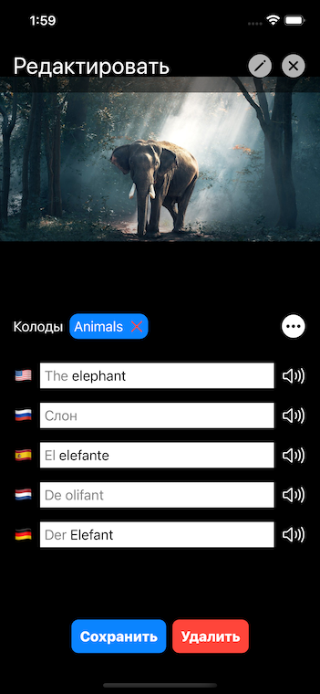
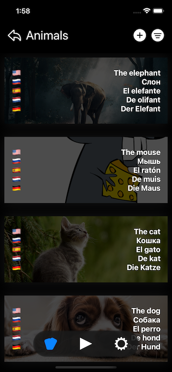
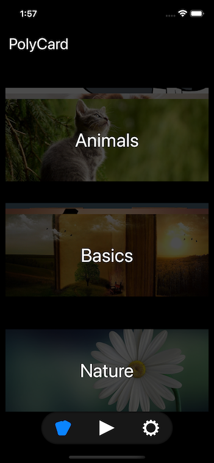
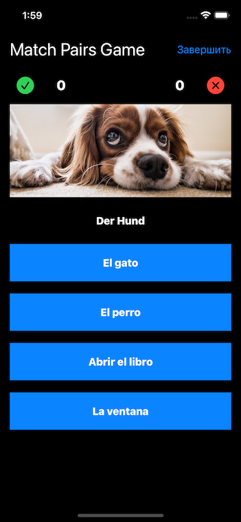

# Multi-language Flashcards for iOS

## Description

iOS/macOS application for creating multi-language cards for practicing words and phrases in different languages at the same time.

## Features 

* Creating multi-language cards containing translation of the word or phrase in multiple languages
* Translate cards using online translation service
* Grouping cards in Decks
* Select card image from your photo library
* Search images in the internet
* iCloud synchronization
* Game mode to repeat words - user can select decks and languages
* Localization in Russian and English

## Current services

* Image search service: [https://pixabay.com](https://pixabay.com)
* Translation service: [https://www.deepl.com/pro-api?cta=menu-pro-api](https://www.deepl.com/pro-api?cta=menu-pro-api)

## Screenshots





## Configuration file
Copy configuration file

```bash
cp Shared/Config.default.xcconfig Shared/Config.xcconfig
```

Edit `Shared/Config.xcconfig`, insert token keys.
